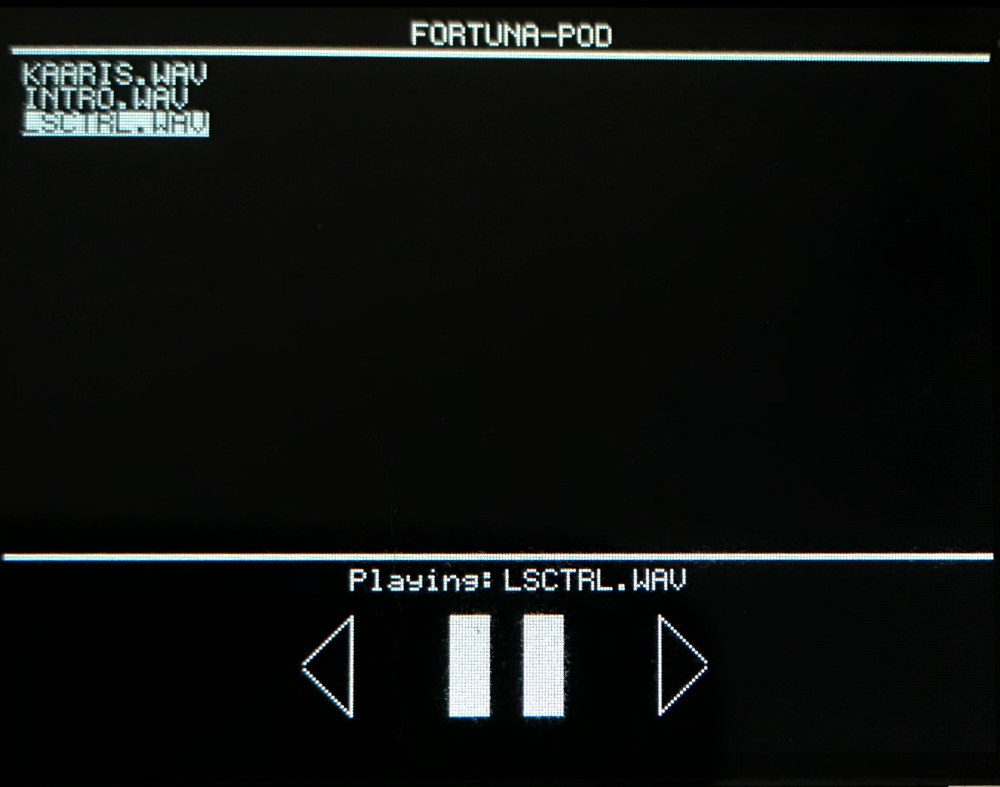

# FortunaPod

## What is it?
FortunaPod is a music player for La Ruota della Fortuna board which is powered by an ATMEL AT90USB1286. It provides a simple, responsive and intuitive UI for the user to scroll through and play the songs he has written to his micro sd-card.

## How to use it
Once you boot it up (with an sd card inserted) a boot-up animation should appear and you will then be greeting with the home screen. From there you will be able to:
+ scroll through your directory using the scroll wheel
+ press on the center button to play a song the cursor is currently pointing at
+ press on the south-pointing button to display music controls

## What type of audio can it play?
It plays audio in the WAV format. Due to the limitations of the processor it can only play back smooth audio at 8KHz in stereo or 16KHz in mono (I would recommend using [this](https://audio.online-convert.com/convert-to-wav) website to convert you audio to WAV as it provides an easy to change bit resolution, sample rate and audio channels).

## Libraries I have used
+ [lafortuna-wav-lib](https://github.com/fatcookies/lafortuna-wav-lib)
+ [FatFs](http://elm-chan.org/fsw/ff/00index_e.html)
+ [lcd](https://secure.ecs.soton.ac.uk/notes/comp2215/tasks/t02/t02ma.zip)(which I have modified)
+ [SmallGraphics](https://github.com/Nick-Bishop/SmallGraphics)(only bresenham part)
+ rios
+ ruota

## Know issues
+ This seems to be a Fortuna issue. I have had a hard time getting my SD card accessed successfully (the mounting works fine) by my board which has made development of this application pretty difficult as I could not reliably test the audio playing feature of this app. If your board successfully reads your root directory, and have audio files in the correct format, you should be able to use of all of the app's features (start/stop music, skip to next/previous track etc...).
+ Graphical artifacts might show up when scrolling the wheel at high speed.

## Possible improvement
+ Add a pause feature to WAV Library
+ change font/size of text
